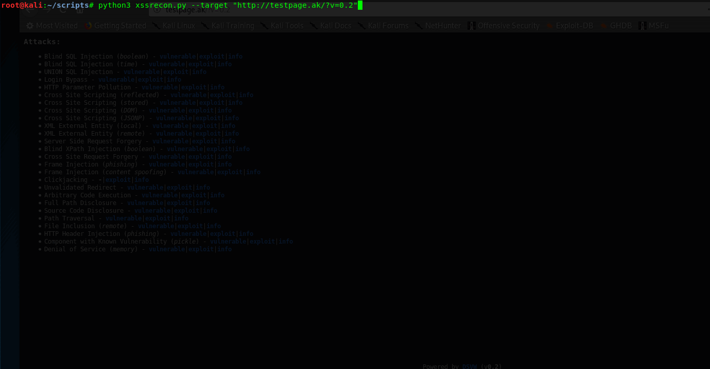
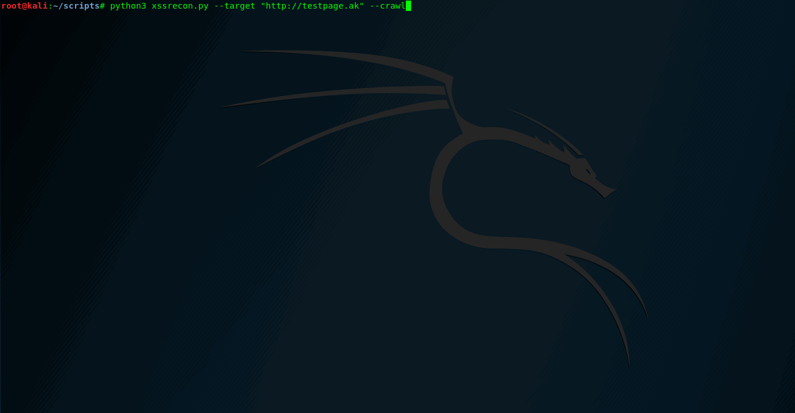

# XSSRecon - Reflected XSS Scanner


* Scans a website for reflected Cross-Site-Scripting
* Zero false positives, its using a real browser checking for the popups
* Automatic out-of-scope checking (experimental, but works very well yet)
* Uses Python 3.7 with selenium / chromedriver
* Crawler or single URL scanner
* Configurable:   
--target | Target to scan   
--crawl | Activate crawler   
--wordlist | Wordlist to use   
--delay | Delay between requests   
--visible | Visible browser for debugging (chromedriver)   
--silent | Only print when vulns have been found   

## Usage & examples

1. Single URL Scan

`
python3 xssrecon.py --target https://example.com/index.php?id=
`
   

2. Crawler   

`
python3 xssrecon.py --target https://example.com --crawl
`
   

## FAQ   
* It doesnt recognize chromedriver on my system!   
Solution:   
Quick install script:
```
sudo apt-get install unzip &&
a=$(uname -m) &&
rm -r /tmp/chromedriver/
mkdir /tmp/chromedriver/ &&
wget -O /tmp/chromedriver/LATEST_RELEASE http://chromedriver.storage.googleapis.com/LATEST_RELEASE &&
if [ $a == i686 ]; then b=32; elif [ $a == x86_64 ]; then b=64; fi &&
latest=$(cat /tmp/chromedriver/LATEST_RELEASE) &&
wget -O /tmp/chromedriver/chromedriver.zip 'http://chromedriver.storage.googleapis.com/'$latest'/chromedriver_linux'$b'.zip' &&
sudo unzip /tmp/chromedriver/chromedriver.zip chromedriver -d /usr/local/bin/ &&
echo 'success?'   
```


* Its too fast! I think its not working correctly!   
Because of that there is the --delay argument :)

* My terminal doesnt seem to work correctly with this tool, instead of showing "live" results it spams my terminal!   
I am working on this, the tool works perfectly on Kali 2019.3, but on 2019.4 ive noticed it spams the terminal (though it does still run like a charm when you use the xterm terminal (for that, simply enter `xterm` into the default terminal)).
If that happens to you, live with the spam or use the `--silent` argument, which only prints when it found a vulnerability

* The crawler scans each href on the website, without checking for duplicates!   
Im working on that, the crawler is experimental yet

* Why cant it do DOM based XSS & generate its own payloads!!   
Im not a cross-site-scripting expert, and i plan to do both of those!

* I want to help!   
Thats great! Feel free to message me! :)
